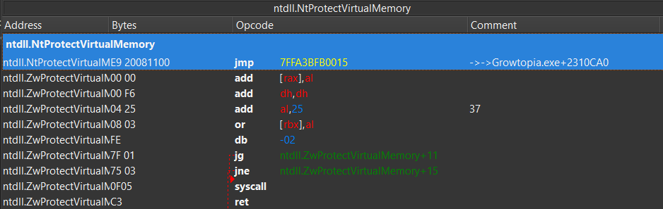
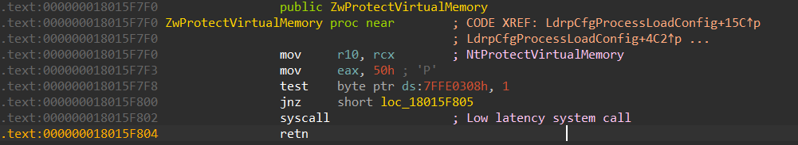

# Nacht

### Info
This is just for learning purpose

### Bypassing Memory Protection of VMProtect
NTProtectVirtualMemory has been hooked and we need to re-write it/replace the jmp to the original byte ( 0x4C, 0x8B, 0xD1, 0xB8, 0x50 )

